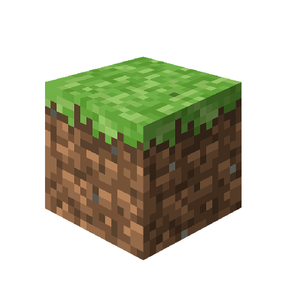
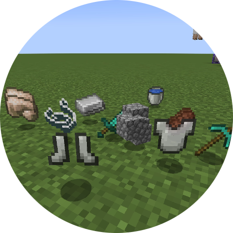
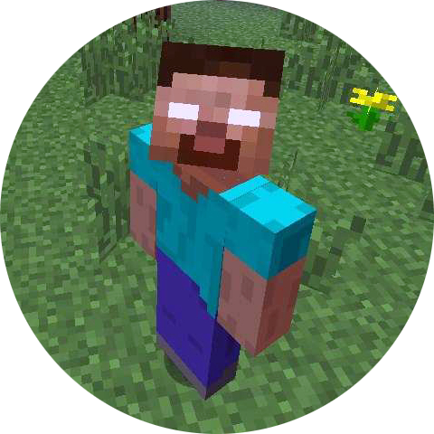
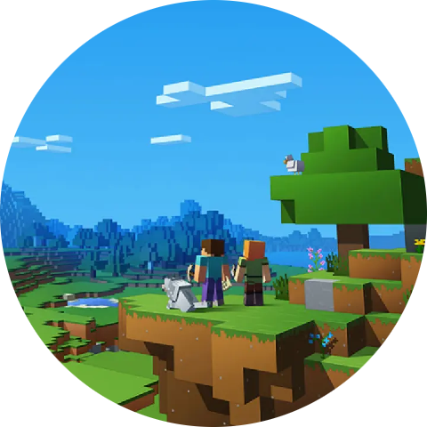
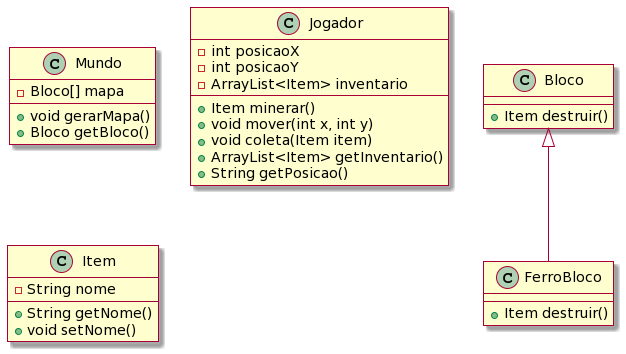
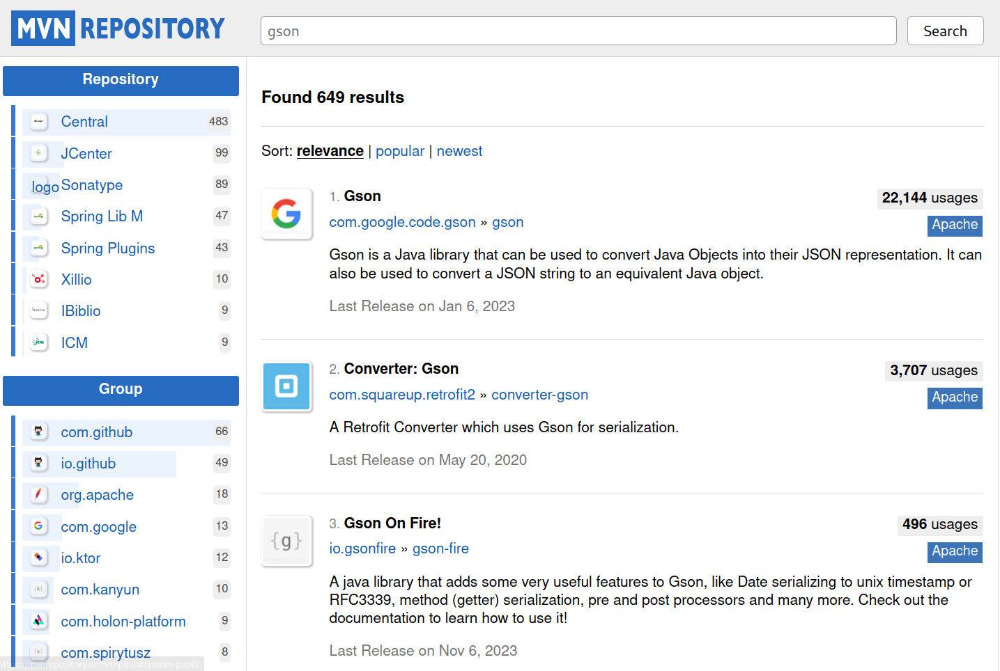

<!-- 
_class: lead
-->

# Aula 05 - Estudos de Caso Java

---

<!--
paginate: true
class: normal
-->

# Estudo de Caso 01 - Minecraft

---

## Visão Geral


*[Minecraft](https://pt.wikipedia.org/wiki/Minecraft)* é um jogo de sandbox e sobrevivência desenvolvido pela Mojang Studios.

É o jogo mais vendido de todos os tempos com mais de 300 milhões de cópias (originais).

---


O mapa do jogo é composto de **blocos** e a principal mecânica gira em torno de destruir, coletar e utilizar blocos em construções e equipamentos.

---

Vamos utilizar alguns dos conceitos do jogo para modelar um pequeno **sistema de texto** que seja capaz de simular algumas mecânicas aplicação o conceito de **orientação à objeto**:

* Gerar um novo **mundo** contendo diferentes **blocos**;
* Iniciar um ou mais **jogadores** dentro do mundo;
* Permitir que o jogador destrua blocos e colete **items**.

---

## Entidades

Ao modelar um sistema utilizando do paradigma de orientação à objeto é importante procurar determinar quais entidades podem ser representadas pela nossa aplicação, além dos **atributos**, **funções** e **relações** entre elas.

---

### Bloco



Um bloco é a construção primordial do jogo. Blocos podem ser de diferentes tipos e podem "soltar" diferentes tipos de **items**.

Além disso, um bloco pode ser de diferentes tipos e possuirem diferentes comportamentos, como por exemplo um bloco de terra e um de ferro (que solta minérios de ferro ao ser destruído).

---

### Item



Um item é a representação de elementos passíveis de serem coletados pelo **jogador**. Esses elementos podem ser equipamentos, recursos ou blocos destruídos de alguma forma.

---

### Jogador



Um jogador é o personagem que interage com o **mundo** em Minecraft. Ele pode destruir blocos, construir entre outras funções.

---

### Mundo



O mundo de Minecraft é essencialmente composto por blocos, itens e jogadores. Essa é a entidade responsável por integrar todas as outras.

---

## Responsabilidades

Com o desenvolvimento do sistema, é natural que algumas relações fiquem confusas. Por exemplo:

* Um bloco deveria ter o atributo posição?
* Um jogador pode acessar um bloco diretamente ou deve usar a entidade mundo?
* O item deve ter uma propriedade para identificar seu dono?

---

A resposta pra essas perguntas nunca é uma regra e depende do nível de detalhes da aplicação, da performance desejada e até da facilidade em escrever o código e mantê-lo.

Existem dois princípios geralmente citados na engenharia de software e relacionados com Extreme Programming (XP): [KISS](https://pt.wikipedia.org/wiki/Princ%C3%ADpio_KISS) (*Keep It Simple* - Deixe isso simples) e [YAGNI](https://en.wikipedia.org/wiki/You_aren%27t_gonna_need_it) (*You Ain't Gonna Need it* - Você não vai precisar disso)

Ambos são uma espécie de lembrete para evitar a "super engenharia" em sistemas de software.

---

## UML

UML (*Unified Modeling Language*) é uma linguagem padrão para modelagem de sistemas. Essa linguagem inclui referências ilustrativas para representar relações de software:

Vamos identificar as relações do nosso sistema usando o **Diagrama de Classes**.

---



---

## Extra: Minetest


Para quem procura uma alternativa gratuita e aberta, a engine [https://github.com/minetest/minetest](Minetest) é um projeto de código-fonte aberto de um motor de jogo (voxel engine) para jogos inspirados no jogo Minecraft.

Um pacote chamado [MineClone2](https://git.minetest.land/MineClone2/MineClone2) reproduz boa parte das mecânicas encontradas no jogo original, porém outros pacotes com diferentes tipos de jogos podem ser baixados e instalados.

---

# Estudo de Caso II - Instagram

---

## Visão Geral


Instagram é um mídia social de fotos e vídeos curtos e uma das maiores plataformas de mídia social da atualidade com mais de 2 bilhões de usuários ativos.

---


A interação básica na plataforma permite aos usuários visualizarem vídeos e fotos, curtir e realizar o upload das suas mídias na plataforma

---

Vamos utilizar um pequeno sistema para simular a interação entre usuários e vídeos, incluindo seu upload para a plataforma:

* Criar e editar dados de um vídeo
* Realizar um "upload" de um vídeo como *post* ou *story*
* Curtir vídeos e comentar a partir de usuários
* Exportar dados de um vídeo no formato JSON

---

### Video


A entidade vídeo representa os dados (não necessariamente o vídeo em si) de um clipe na plataforma. Deve incluir atributos como título, comentários, likes e usuário.

Um vídeo pode ser dividido em dois tipos: **Story** e **Post**.

---

### Usuário


Representa um usuário da plataforma. Um usuário pode assistir, comentar e curtir vídeos da plataforma.

---

### Upload


Mesmo se tratando de uma entidade mais subjetiva, a entidade upload é responsável por armazenar e controlar dados de um vídeo no momento do upload. É uma classe de transição entre diferentes estados de um vídeo.

---

### Exportador JSON


Assim como o upload, também representa uma entidade bastante funcional. Um objeto como esse será responsável pela tradução de um objeto java para o modelo JSON.

---

## JSON e GSON

[JSON](https://www.json.org/json-pt.html) (Javascript Object Notation) é um padrão de texto utilizado para a troca de dados entre aplicações.

[GSON](https://github.com/google/gson) é uma biblioteca da Google utilizada para serializar objetos para o formato de texto JSON e vice-versa (desserializar)

---

## Apache Maven


[Apache Maven](https://maven.apache.org/) é uma ferramenta para automação de compilação e gerenciamento de projeto usada na plataforma Java. É similar a outras ferramentas como Gradle e Ant (ou NPM/Yarn na plataforma Node.js).

---

### Adicionando uma dependência no Maven

Para projetos criados e gerenciados usando a ferramenta Maven, temos o arquivo `pom.xml` na pasta raiz. O conteúdo desse arquivo é parecido com o seguinte:

```xml
<?xml version="1.0" encoding="UTF-8"?>
<project xmlns="http://maven.apache.org/POM/4.0.0"
         xmlns:xsi="http://www.w3.org/2001/XMLSchema-instance"
         xsi:schemaLocation="http://maven.apache.org/POM/4.0.0 http://maven.apache.org/xsd/maven-4.0.0.xsd">
    <modelVersion>4.0.0</modelVersion>
    <groupId>org.example</groupId>
    <artifactId>meu-estudo</artifactId>
    <version>1.0-SNAPSHOT</version>
    <properties>
        <maven.compiler.source>21</maven.compiler.source>
        <maven.compiler.target>21</maven.compiler.target>
        <project.build.sourceEncoding>UTF-8</project.build.sourceEncoding>
    </properties>
</project>
```

---



Adicionar uma nova dependência ao projeto significa declarar uma biblioteca ao Maven para que este fique responsável por baixar, organizar e vincular a biblioteca ao projeto.

Para isso, vamos pesquisar a biblioteca desejada no site [Maven Repository](https://mvnrepository.com/).

---

Escolhendo neste exemplo a biblioteca GSON, basta apenas selecionar sua versão e copiar o *snippet* para dentro do arquivo `pom.xml`.

```xml
<dependency>
    <groupId>com.google.code.gson</groupId>
    <artifactId>gson</artifactId>
    <version>2.10.1</version>
</dependency>
```

O *snippet* deve ser colado dentro da tag `<dependencies>`, que se não existir, deve ser criada.

---

O arquivo final deve ficar similar ao abaixo:

```xml
<?xml version="1.0" encoding="UTF-8"?>
<project xmlns="http://maven.apache.org/POM/4.0.0"
         xmlns:xsi="http://www.w3.org/2001/XMLSchema-instance"
         xsi:schemaLocation="http://maven.apache.org/POM/4.0.0 http://maven.apache.org/xsd/maven-4.0.0.xsd">
    <modelVersion>4.0.0</modelVersion>
    <groupId>org.example</groupId>
    <artifactId>meu-estudo</artifactId>
    <version>1.0-SNAPSHOT</version>
    <properties>
        <maven.compiler.source>21</maven.compiler.source>
        <maven.compiler.target>21</maven.compiler.target>
        <project.build.sourceEncoding>UTF-8</project.build.sourceEncoding>
    </properties>
    <dependencies> <!-- Declarar essa tag se não existir -->
        <dependency>
            <groupId>com.google.code.gson</groupId>
            <artifactId>gson</artifactId>
            <version>2.10.1</version>
        </dependency>
    </dependencies> <!-- Declarar essa tag se não existir -->
</project>
```

---

Após colar o *snippet*, utilize a interface da IDE para atualizar o repositório.

O repositório Maven também pode ser atualizado usando um comando diretamente no terminal:

```sh
mvn package
mvn install
```

---

## Terminologia

`Entidade` - Elemento que representa a identidade de um ou mais objetos
`Snippet` - Pedaço de código-fonte
`Post` - Postagem (em mídias sociais)
`Story` - Vídeo curto ou imagem compartilhada pelo Instagram.

---

## O que aprendemos hoje

* Como modelar um sistema utilizando dos conceitos de Orientação à Objeto;
* Como adicionar dependencias à um projeto usando Maven;
* Serializar um objeto java para o padrão JSON;