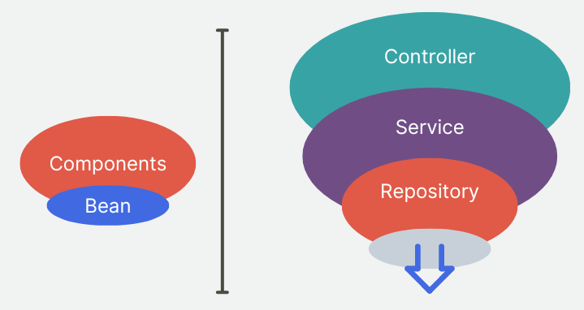

<!-- 
_class: lead
-->

# Aula 06 - Spring Framework

---

<!--
paginate: true
class: normal
-->

## Spring Framework


* Framework para padrão de projeto (IoC);
* Modular e Escalável;
* Aplicações Empresariais (alto nível de maturidade) na plataforma Java.

---

### História do Spring


* Desenvolvido em 2003 (1.0 em 2004)
* Surge como substituto para as especificações J2EE (javax)
* Versão atual: 6 (requer Java 17+)
* Implementa em complementa especificação Jakarta

---

### Spring Beans


* Unidade básica do Spring
* Objetos java que são controlados pelo Spring Container
* Podem representar entidades de dados até serviços e controladores.

---

### Spring Context


* Define um contexto dentro da aplicação;
* Encapsula um conjunto de Spring Beans;
* Controle o ciclo de vida dos beans;
* Separação de responsabilidades em diferentes contextos.

---

### Spring Container


* Também conhecido como IoC Container;
* Responsável por gerenciar receber e fornecer os Spring Beans de uma aplicação;
* Divide-se em `BeanFactory` e `ApplicationContext`;

---

## Inversão de Controle

O termo inversão de controle é um padrão de design que sugere que o controle do fluxo do programa seja feito de maneira inversa ao clássico paradigma procedural.

---


Esse padrão é especialmente útil na construção de frameworks que realizem o controle de fluxo de uma aplicação.

---

### Injeção de Dependência

Além de lidar com o ciclo de vida dos componentes/objetos, o Spring permite que o desenvolvedor implemente a inversão de controle dentro de sua aplicação através de uma técnica chamada **Injeção de Dependência**, usando o *Spring IoC Container*.

---

Para explificar a injeção de dependência, tome o seguinte exemplo como base:

```java
public class Musica {
    private Artista artista;
    
    public Artista getArtista() {
        return this.artista;
    }
}

public class Artista {
    private String nome;

    public String getNome() {
        return this.nome;
    }
}
```

---

Ao inicializar um novo objeto do tipo música e acessar o atributo artista, iremos acessar apenas um objeto `null`, já que o atributo `artista` nunca foi inicializado.

```java
public class Main {
    public static main(String[] args) {
        Musica musica = new Musica();
        musica.getArtista().getNome(); // NullPointerException
    }
}
```

---

Para resolver esse problema, podemos realizar a criação do objeto `artista` durante a criação de um objeto do tipo `Musica` (no construtor). Nesse caso, dizemos que a entidade `Musica` possui uma dependência da classe `Artista`.

```java
public class Musica {
    private Artista artista;
    // Construtor
    public Musica() {
        this.artista = new Artista();
    }
}
```

No entanto, é comum que nesse exemplo, o `Artista` precise ser criado antes da `Musica`.

---

Usando o princípio da **Injeção de Dependência**, podemos passar o atributo artista no momento da construção do objeto música:

```java
public class Musica {
    private Artista artista;
    // Construtor
    public Musica(Artista artista) {
        this.artista = artista;
    }
}

public class Main {
    public static main(String[] args) {
        Artista artista = new Artista();
        Musica musica = new Musica(artista);
    }
}
```

---

O **Spring Framework** implementa o conceito de inversão de controle para que o desenvolvedor não tenha que se preocupar com o ciclo de vida dos objetos de sua aplicação.

Do ponto de vista de aplicações complexas, onde temos um grande fluxo de objetos sendo criados e compartilhados entre diferentes instâncias, a Inversão de Controle e Injeção de Dependências controlada pelo framework serve para diminuir a complexidade da aplicação e da implementação das regras de negócio.

---

Também podemos utilizar o Spring no caso anterior para injetar a dependência diretamente no objeto em tempo de execução.

```java
@Component
public class Musica {
    private Artista artista;
    //Construtor
    @Autowired
    public Musica(Artista artista) {
        this.artista = artista;
    }
}
```

> Ao criar um objeto do tipo `Musica`, o Spring usará uma instância ativa ou criará um novo objeto para o atributo `artista`.

---

Em resumo:

**Inversão de Controle** (*IoC - Inversion of Control*) é um padrão de design onde o fluxo de um objeto é definido por instâncias externas e não por ele mesmo.

**Injeção de Dependências** (*Dependency Injection*) é uma técnica usada para implementar objetos ou funções de forma que recebam outros objetos ou funções do qual dependam.

---

O uso dessa abordagem pode garantir pelo menos três vantagens no desenvolvimento:

* Aumentar a separação de responsabilidades entre cada objeto, garantindo um código mais fácil de modificar no futuro.

* Facilidade para alternar entre diferentes implementações sem alterar o código;

* Garantir testabilidade, já que é possível alterar as dependências de um objeto de maneira muito mais simples.

---

## Módulos Principais do Spring


* Core
* Beans
* Context
* AOP

---

### Outros módulos

* Data
* Web
* Boot
* Security

---

## Spring Annotations

O Spring inclui anotações que podem ser adicionadas sobre uma classe ou método que são usadas para definir comportamento ou configuração das operações de código.

```java
@Configuration
@ComponentScan("org.example")
public class ProjectConfiguration{
    @Bean
    Artista artista() {
        return new Artista()
    }
}
```

---

### `@Bean`

Usado para determinar um método Factory capaz de instanciar um objeto a ser gerenciado pelo Spring.

### `@Autowired`

Marca uma dependência (atributo ou construtor) cujo o Spring será responsável por resolver e injetar.

---

### `@ComponentScan`

Define os pacotes e classes cujo o Spring será capaz de escanear

### `@Configuration`

Define uma classe de configuração do Spring

### `@Component`, `@Repository`, `@Service`, `@Controller`

Define um componente para aplicação, de acordo com a sua camada e suas responsabilidades.

---

## Arquitetura em Camadas



Arquitetura de camadas é um dos padrões arquiteturais mais comuns no desenvolvimento de software. Nele construímos e agrupamos componentes de acordo com suas responsabilidades, dividindo-os em camadas.

---

### Controller

Controllers (Controladores) são componentes cujo a responsabilidade é receber, processar e responder ao ao cliente. Entre os trabalhos do Controller estão interpretar os dados recebidos (parsing), chamar o serviço requisitado (service layer) e preparar a resposta.

---

### Service

Services são responsáveis por implementar a chamada **Regra de Negócios** (*Bussiness Logic*), onde toda a lógica por trás da operação requisitada pelo usuário será processada (depois de ser identificada pelo controller).

---

### Repository

Repositories são classes responsáveis pela persistência de dados da aplicação, seja, por exemplo, um banco de dados, arquivos ou APIs externas.

---

### Component

Components (Componentes) são tecnicamente usados de forma parecida com @Service e @Repository, porém possuem semântica mais genérica do que as outras anotações citadas.

---

### Bean

Ao contrário dos anteriores, a anotação Bean é usada a nível de método, quando queremos criar uma Factory para objetos que serão manipulados pelo Spring

---

## Glossário

`Framework`
*(como o Spring)* aplicações responsáveis por determinar o fluxo de uma aplicação;

`Regras de Negócio`
Lógica de um caso de uso da aplicação;

`Inversão de Controle`
Padrão de design onde uma entidade não é responsável pelo controle do próprio fluxo (em oposição ao paradigma procedural);

---

`Injeção de Dependência`
técnica que permite que uma entidade receba as dependências de que necessita;

`Factory`
método que cria e retorna um objeto;

---

## O que aprendemos hoje

* Adicionar o Spring Framework em uma aplicação
* Inversão de Controle e Injeção de Dependências
* Anotações do Spring
* Introdução à arquitetura de camadas